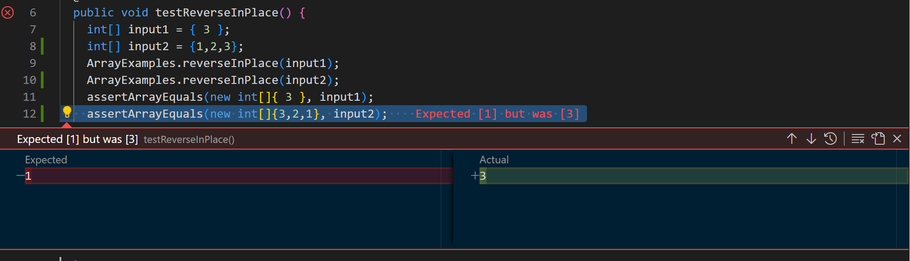

**Part One**

A failure-inducing input for the buggy program: 
```
public void testReverseInPlace() {
    int[] input2 = {1,2,3};
    ArrayExamples.reverseInPlace(input2);
    assertArrayEquals(new int[]{3,2,1}, input1);
```

An input that doesn't induce a failure:
```
public void testReverseInPlace() {
    int[] input1 = { 7 };
    ArrayExamples.reverseInPlace(input1);
    assertArrayEquals(new int[]{ 7 }, input1);
```
The symptom: 
 

The bug:
```
  static void reverseInPlace(int[] arr) {
    for(int i = 0; i < arr.length; i += 1) {
      arr[i] = arr[arr.length - i - 1];
    }
  }
```

Fixed: 
```
  static void reverseInPlace(int[] arr) {
    for (int i = 0; i < arr.length / 2; i += 1) {
      int placeholder = arr[i];
      arr[i] = arr[arr.length - i - 1];
      arr[arr.length - i - 1] = placeholder;
    }
  }
```
In the original code, the reversed values are not saved for the next iteration. This causes the final array to repeat numbers because certain values in the array are not updated correctly. In my code, we only iterate up to ```arr.length / 2``` to avoid the issue in the original code. I then store ```arr[i]``` in the temporary placeholder, which will later be set to ```arr[arr.length - i - 1]``` to "reverse" the array.
